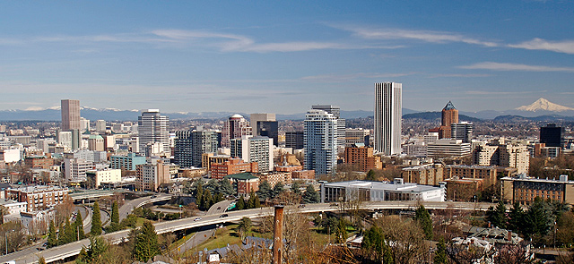

# PDXFade

## Why?

There are a lot of slideshows out there, but they’re all way too feature
rich. For example the [Nivo Slider](http://nivo.dev7studios.com/) is amazing, and can basically do
what this does, but it’s so over the top. Added bonus, is this slideshow
doesn’t require *any* CSS. Style how you want without fuss.

## How?

Download the source (or clone it if you’re a GitHub user). Add a scipt
tag like:

    

Then make an `<ul>` or `<ol>` with ``s in the `<li>`s for slides.
You can wrap them with `<a>`s for links. You can also add `<h2>`s for
titles of the slides and `
`s for the description. For example:

    <ul id="slideshow">
      <li>
        
        <h2>The City</h2>
        
Welcome to Portland, Oregon

      </li>
      <li>
        
        <h2>Get Out</h2>
        
It's nice out

      </li>
    </ul>

After simply call `pdxfade();` in your jQuery like:

    $('#slideshow').pdxfade();

### Options

There are some options you can modify as well to customize the
slideshow. The stuff in the parentheses is the default value and the
square brackets represent the type you give it:

-   `animationTime (500)[int]`:  
    How long the fading transitions lasts in milliseconds.
-   `titleTag (h2)[str]`:  
    The tag that’ll be looked for and wrapped around the text used as
    the title.
-   `descriptionTag (p)[str]`:  
    The tag that’ll be looked for and wrapped around the text as the
    description.
-   `delayTime (5000)[int]`:  
    How long to wait on a slide before going to the next one in
    milliseconds.
-   `width (auto)[str]`:  
    The width of the slideshow. By default it guesses, but you can set a
    specific width too.
-   `height (auto)[str]`:  
    Same as width.
-   `classNamespace (pdxfade)[str]`:  
    This is prepended to all the class names in the slideshow. If you
    want to customize the class names you’d change it here. It’ll affect
    *all* class names shown below.
-   `arrowColor (white)[str]`:  
    Can be `white` or `black`. It’s used to change the next and previous
    arrow colors.

If you’re new to jQuery plugins, here’s an example of changing two of
these options:

    $('#slideshow').pdxfade({animationTime:1000,namespace:'myslideshow'});

### Class Names

These are a list of class names used in the slideshow. You can use this
to further customize your slideshow. The `pdxfade-` can be modified
using the the `classNamespace` option above.

-   `pdxfade-active-slide`:  
    Class used on the visible/active slide.
-   `pdxfade-slideshow-wrapper`:  
    When the slideshow is activated the `ul` or `ol` is wrapped in a
    `div` with this class.
-   `pdxfade-previous` and `pdxfade-next`:  
    These two classes represent the next and previous arrow `img`s. on
    top of the slides.
-   `pdxfade-overlay`:  
    The class used for the black overlay containing the title and
    description of the images.
